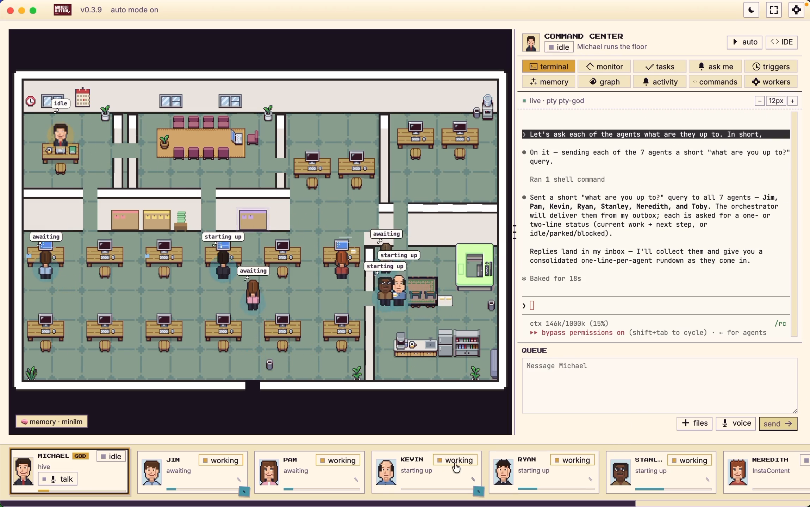
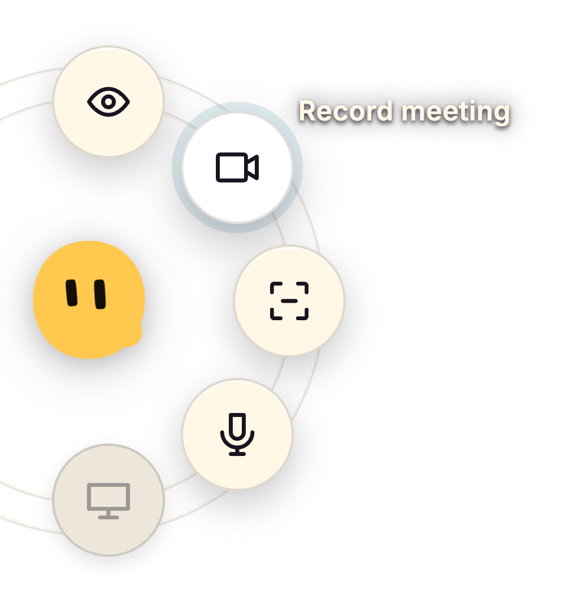
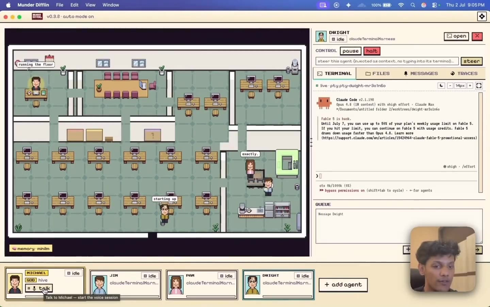
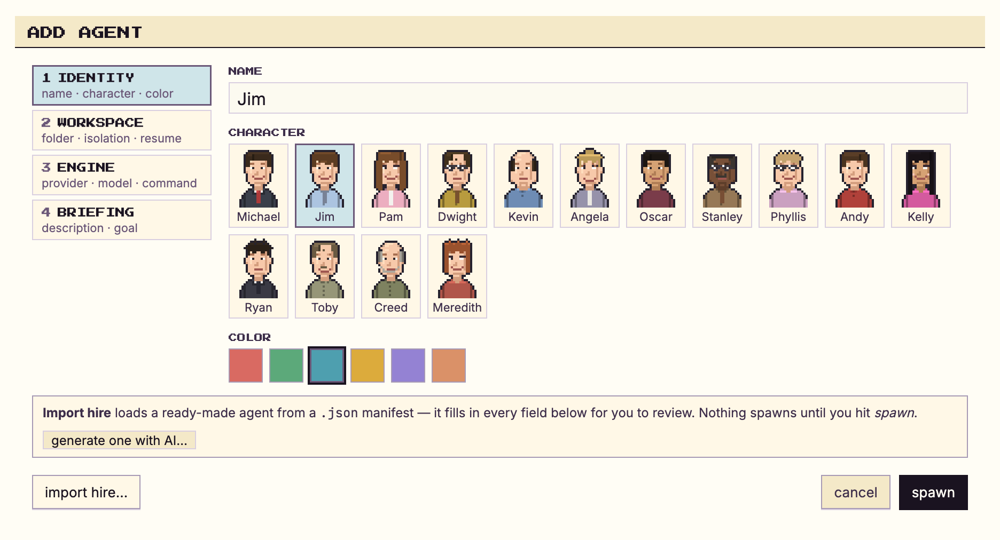
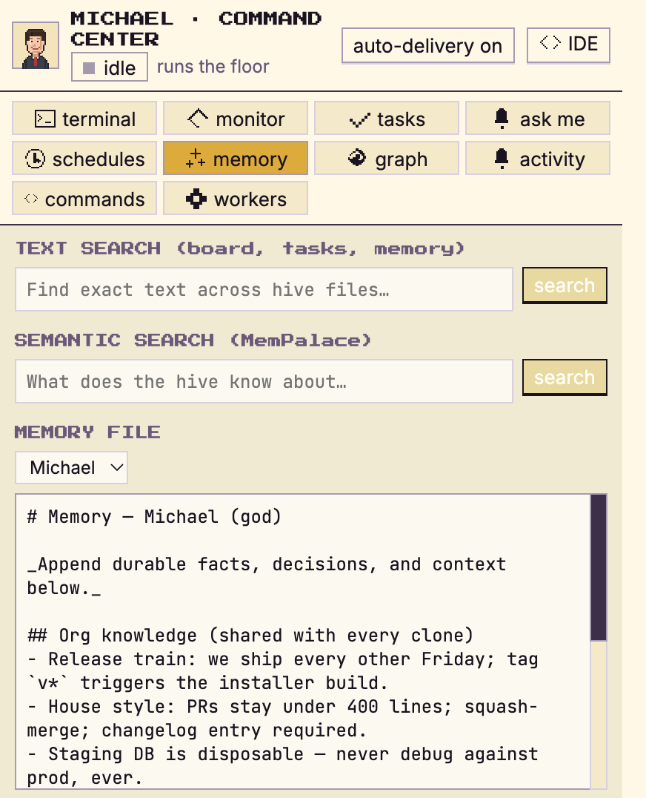
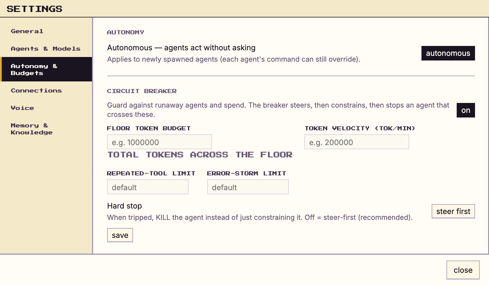
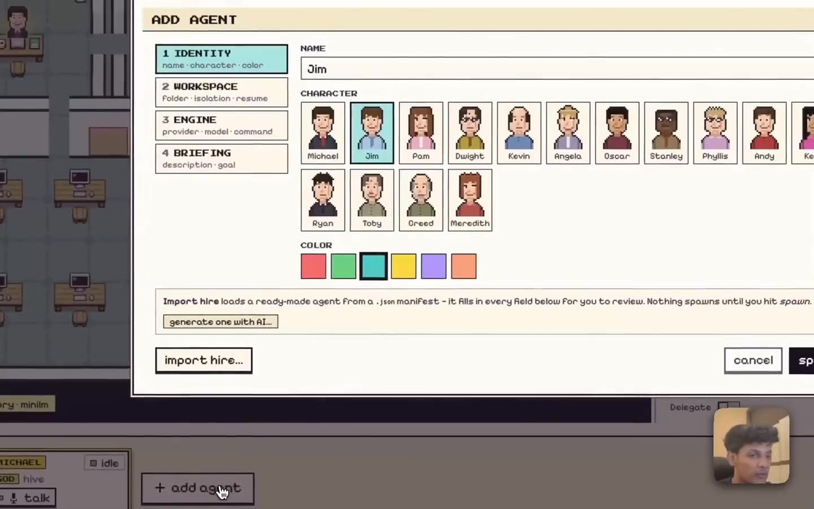
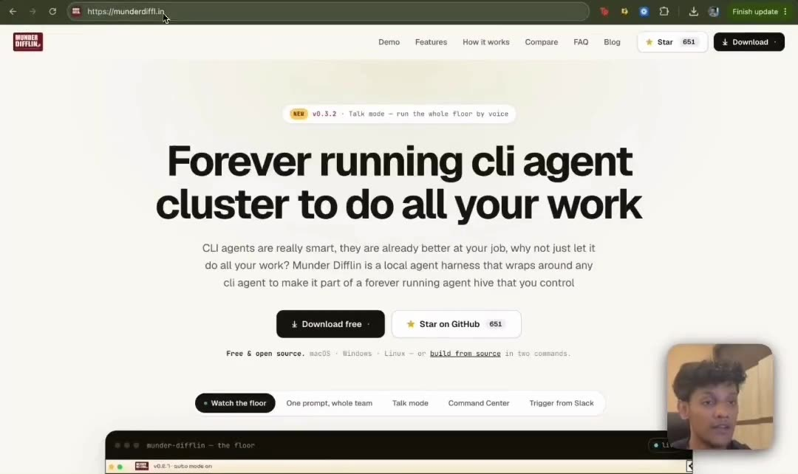

<div align="center">


# Munder Difflin

### Agent harness to run an office of your clones

<p>
  <a href="https://trendshift.io/repositories/46562" target="_blank" rel="noopener noreferrer"></a>
  <a href="https://www.producthunt.com/products/munder-difflin?embed=true&utm_source=badge-top-post-badge&utm_medium=badge&utm_campaign=badge-munder-difflin" target="_blank" rel="noopener noreferrer"></a>
</p>



**Free, open source and performant.** A multi-agent harness that works with the
subscriptions you already pay for, on their hourly limits. It turns the terminal coding CLI
you already run into a clone of you, one that keeps working while you're away and
coordinates a whole office of agents on your own machine.

Wraps [Claude Code](https://claude.com/claude-code), Antigravity (Gemini), OpenAI Codex,
**xAI Grok**, **Kimi Code**, **Gemini CLI**, **Qwen**, **OpenCode**, **Crush**,
**pi.dev**, **GitHub Copilot CLI**, and **Cursor**, with bring-your-own keys and local LLMs.
Agents that message, route, and remember, coordinated by **your clone** (Michael) and
visualized as avatars at work on a shared office floor.

<p>
  <em>Electron · React · TypeScript · Pixi.js · xterm.js · node-pty</em>
</p>

<p>
  <a href="./LICENSE"></a>
  <a href="./CHANGELOG.md"></a>
  <a href="https://github.com/chaitanyagiri/munder-difflin/releases"></a>
  
  
  <a href="./CONTRIBUTING.md"></a>
  <a href="https://munderdiffl.in/blog/"></a>
  <a href="https://discord.gg/SEDzP5ZPk5"></a>
</p>

<br>

<!-- Inline player renders on github.com (raw URL required; relative paths only link). -->
<video src="https://github.com/chaitanyagiri/munder-difflin/raw/main/docs/media/hero.mp4" controls muted loop playsinline width="820">
  <a href="https://github.com/chaitanyagiri/munder-difflin/raw/main/docs/media/hero.mp4">▶ Watch the floor: Munder Difflin running a hive of Claude Code agents</a>
</video>

<br><br>

**[⬇ Download 0.5.3 for macOS, Windows or Linux](https://harnessmd.com/download)**

<sub>macOS builds are signed and notarized. You do not need to build from source to use it.
The open source build is on the <a href="https://github.com/chaitanyagiri/munder-difflin/releases/tag/v0.5.3">GitHub releases page</a>.</sub>

**Cancel your Granola and Wispr Flow subscriptions.** 0.5.3 dictates into any app and transcribes your
meetings, all running locally.

<sub><b>Launch offer:</b> the Pro annual plan for $150 USD, adjusted for purchasing power in different
countries and as low as $100 a year. <a href="https://app.harnessmd.com/console/license">Get Pro</a></sub>

</div>

---

> [!NOTE]
> **The world's best agents. The world's worst paper company.**
> Munder Difflin takes the terminal-agent CLIs you already run (`claude`, `agy`, `codex`, `grok`,
> `kimi`, `qwen`, `opencode`, `crush`, `pi`, and `copilot`) and turns them
> into a self-coordinating team: each agent gets long-term memory, a mailbox, and a desk on a 2D
> office floor, and **your clone** (Michael) routes work between them while you watch. He's the
> boss of the floor; you're still the boss of him.

## Contents

- [Supported agents](#supported-agents)
- [What it is](#what-it-is)
- [How it works](#how-it-works)
- [Features](#features)
- [Getting started](#getting-started)
- [Architecture & project structure](./docs/ARCHITECTURE.md)
- [Roadmap](#roadmap)
- [Contributing](#contributing)
- [Telemetry](#telemetry)
- [License](#license)
- [Acknowledgements](#acknowledgements)

## Supported agents

**Bring the CLI you already pay for.** Every one of these runs as a real process in its own
terminal, with your existing subscription and its hourly limits. If it runs in a terminal, it
can run here.

<p>
  <a href="https://docs.claude.com/en/docs/claude-code"><kbd>Claude Code</kbd></a>
  <a href="https://github.com/openai/codex"><kbd>Codex · GPT</kbd></a>
  <a href="https://x.ai/cli"><kbd>Grok · xAI</kbd></a>
  <a href="https://www.kimi.com/code"><kbd>Kimi Code</kbd></a>
  <a href="https://github.com/google-gemini/gemini-cli"><kbd>Gemini CLI</kbd></a>
  <a href="https://antigravity.google/docs/cli-overview"><kbd>Antigravity · Gemini</kbd></a>
  <a href="https://github.com/QwenLM/qwen-code"><kbd>Qwen</kbd></a>
  <a href="https://opencode.ai/docs"><kbd>OpenCode</kbd></a>
  <a href="https://github.com/charmbracelet/crush"><kbd>Crush · Charm</kbd></a>
  <a href="https://pi.dev/docs/latest"><kbd>Pi</kbd></a>
  <a href="https://docs.github.com/copilot/concepts/agents/about-copilot-cli"><kbd>GitHub Copilot</kbd></a>
  <a href="https://cursor.com/docs/cli/install"><kbd>Cursor</kbd></a>
  <kbd>+ any custom command</kbd>
</p>

Plus **bring your own keys** and **local models** through Ollama, LM Studio or vLLM.

## What it is

Munder Difflin is a desktop app that wraps **real terminal-agent CLIs** as fully-capable agents,
wires them into a **hive mind**, and puts **your clone** in charge. Michael is the one agent *you*
talk to in order to get things done. Under the hood it runs the **fastest memory layer in the
world** so every agent remembers what it learns and recalls it instantly.

- **Every terminal is an agent.** Each `claude`, `agy`, `codex`, `grok`, `kimi`, `qwen`, `opencode`, `crush`, `pi`, `copilot`, or custom session runs as a real
  process in a pseudo-terminal (`node-pty`), byte-for-byte authentic, rendered with xterm.js.
- **Every agent is an avatar.** Sessions appear as characters on a Pixi.js office floor. They walk
  to stations as they work, and envelopes fly desk-to-desk when they message each other.
- **The hive coordinates them.** Agents read their memory and drain a mailbox; the router moves
  messages between inboxes; the GOD agent adjudicates, assigns, and escalates only when it needs you.
- **Memory that's instant.** A markdown-first memory layer with a semantic recall index means agents
  remember across sessions and recall in milliseconds.

## How it works

```
            you ── talk to ──►  ┌─────────────┐
                                │  GOD agent  │  orchestrator / supervisor
                                │ (Michael's  │  roster · routing · adjudication
                                │   office)   │  blackboard · task ledger
                                └──────┬──────┘
                                       │ assigns · routes · escalates
              ┌────────────────────────┼────────────────────────┐
              ▼                         ▼                         ▼
        ┌───────────┐            ┌───────────┐            ┌───────────┐
        │  agent A  │  message   │  agent B  │  message   │  agent C  │
        │ provider  │ ─────────► │ provider  │ ─────────► │ provider  │
        │  + memory │            │  + memory │            │  + memory │
        └───────────┘            └───────────┘            └───────────┘
              └──────── shared hive: memory · mailbox · blackboard · log ───────┘
```

1. **You spawn agents**: each is a normal terminal process (`claude`, `agy`, `codex`, or custom)
   with its own working directory, identity, and provider-specific lifecycle.
2. **Agents collaborate through the hive**: a local git repo of plain files. They write to their own
   `outbox/`; the harness's router delivers into recipients' `inbox/`. No agent ever touches git
   (single-committer design avoids `index.lock` corruption).
3. **The GOD agent runs the floor**: it reads every request, resolves routine ones itself (keeping
   the system fully autonomous), and only escalates *critical* items (spend, destructive ops, scope
   changes) into an approvals queue you act on.
4. **Everything is visible**: you watch avatars move, envelopes fly, and the live terminal stream;
   you can type back into any session, browse its files, and read its git history.

See [`HIVE.md`](./HIVE.md) for the full multi-agent design, [`SPEC.md`](./SPEC.md) for the
terminal/event plane, and [`DESIGN.md`](./DESIGN.md) for the visual system.

## Features

<table>
<tr>
<td width="50%" valign="middle">

### Cancel your Granola and Wispr Flow subscriptions

**Dictate into any app.** Hold Option on the Mac, or Control+Alt+Space on Windows and Linux (X11),
talk, and let go. The words land in whatever field is in front of you, and in every text box inside
Munder Difflin. The message box mic works in the free build too.

**Meetings hear both sides**, in Stapler, part of Pro. Your microphone is written as You and the
call's audio as Them, on Mac, Windows and Linux. Shift+Command+Space starts and stops a meeting on
the Mac, Control+Shift+Space on Windows and Linux. Correct the transcript, add a description, and
send it to any of your agents.

**Transcription on your machine.** A Whisper model ships inside the app and is the default engine.
A larger model is one download away, Apple's on device recogniser works on macOS 26, and Groq stays
off unless you add a key. 126 built in technical names plus your own words. English for now.



</td>
<td width="50%" valign="middle">

### One row per agent, and it tells you everything

Classic, the free skin, gets the new agent cards: status, engine, model, a context gauge, the
ticket it is on and the action it is taking right now, a crash strip instead of a silent
terminal, and a right click menu for the common jobs.

Pro gets the new sidebar: Tasks, Inbox, Automations, Memory, Capabilities and the Stapler at the
top, agents grouped under their projects, a live line per agent, **Asked you** on the row when an
agent has a question, notes you can search, and **Keep my agent order** to drag agents and projects
where you want them. Drag the sidebar's edge to make it wider, hover a ticket for its details, or
switch to agents and notes only.

</td>
</tr>
<tr>
<td width="50%" valign="middle">

### Talk to one agent, not twelve

Michael is your clone and the only agent you brief. He assigns the work, routes the traffic, and
escalates the few things that actually need you.

</td>
<td width="50%">
  <a href="https://github.com/chaitanyagiri/munder-difflin/raw/main/docs/media/demo/orchestrator.mp4"></a>
</td>
</tr>
<tr>
<td width="50%" valign="middle">

### Hire an agent in a few clicks

Pick the CLI, the model and the autonomy, give it a desk, and it starts working. Import a
ready made role from the [Agent Gallery](https://munderdiffl.in/hires/) if you would rather not
start from scratch.

</td>
<td width="50%">
  
</td>
</tr>
<tr>
<td width="50%" valign="middle">

### Memory that survives the session

Every agent keeps markdown memory that is mined into a shared, searchable palace. Close the app,
come back tomorrow, and they still know what they learned.

</td>
<td width="50%">
  
</td>
</tr>
<tr>
<td width="50%" valign="middle">

### Autonomy with a leash

Set how far each agent may go on its own. Spend, scope and destructive operations come back to
you, and a circuit breaker steers, constrains, then stops anything that loops or runs away.

</td>
<td width="50%">
  
</td>
</tr>
<tr>
<td width="50%" valign="middle">

### Watch the whole floor work

Agents walk to stations as they work and envelopes fly desk to desk when they message each other.
Click any desk to read that terminal live, and type straight back into it.

</td>
<td width="50%">
  <a href="https://github.com/chaitanyagiri/munder-difflin/raw/main/docs/media/demo/agents.mp4"></a>
</td>
</tr>
<tr>
<td width="50%" valign="middle">

### Set up once

The onboarding wizard checks what you already have, and offers to install what is missing rather
than sending you to a docs page.

</td>
<td width="50%">
  <a href="https://github.com/chaitanyagiri/munder-difflin/raw/main/docs/media/demo/setup.mp4"></a>
</td>
</tr>
</table>

**The floor**
- **Every terminal is a real agent.** Claude Code, Antigravity (Gemini), OpenAI Codex, xAI Grok, Kimi Code, Gemini CLI, Qwen, OpenCode, Crush, pi.dev, GitHub Copilot CLI, Cursor, or a custom command, each in its own `node-pty` PTY, rendered with xterm.js.
- **Every agent is an avatar.** A Pixi.js office floor where agents walk to stations, envelopes fly desk to desk, and avatar state reflects real work.
- **A GOD orchestrator you talk to.** It routes tasks, adjudicates traffic, and escalates only what needs a human. Or press **Talk** and run the floor by voice.
- **Per-agent git worktrees.** Optional isolation so parallel agents never collide on branches.
- **More than one floor** (0.5.3). File, New Floor opens another office on its own folder, in its own window, with its own agents, board and memory. A folder only ever opens in one floor, and one licence covers them all.

**Memory & coordination**
- **The hive**: per-agent memory, atomic-file mailboxes, a shared blackboard, an append-only event log, single-committer git.
- **Semantic recall**: markdown memory mined into a shared palace, searchable from the UI, with condensation so it doesn't grow forever.
- **Enterprise Knowledge Graph**: your own documents and policies, queryable by any agent.

**Control & safety**
- **Human gates**: spend, scope, and destructive ops escalate to you. Steer mid-run or stop gracefully.
- **Circuit breaker**: a steer → constrain → stop ladder for agents that loop, storm errors, or blow their budget.
- **Budgets & telemetry**: per-agent token budgets, real cost from transcripts, a durable ledger, OTel spans, and a tool waterfall.

**Command Center**
- **Tickets with keys** (0.5.3): every card gets a key like V53-299, each agent has a Tasks tab with what it did and when, and the Tasks screen filters by date.
- Kanban tasks with dependencies, scheduled missions + heartbeat, live fleet monitoring, memory search, activity log, and a CI watcher.
- **Skills**: what every agent can already do across Claude Code, OpenCode and Codex, plus a browsable catalog of 227 more with search, filters, install and uninstall.
- **Built-in Monaco IDE**: file tree, editor tabs, save, plus CHANGES · HISTORY · COMPARE git rails with commit graph, diffs, branch compare, and guarded checkout. All fs/git access brokered through main.

**Getting work in and out**
- **Slack & webhooks**: message a channel or POST a webhook; Michael can spawn an ephemeral worker, reply in-thread, and tear it down.
- **Shareable hires + Agent Gallery**: import a role from a `munderdifflin://hire` link; import only pre-fills the form, a human still spawns it. Browse roles at the [Agent Gallery](https://munderdiffl.in/hires/).
- **Local transcription and dictation** (0.5.3): dictate into any app (Option on the Mac,
  Control+Alt+Space on Windows and Linux X11), and Stapler in Pro transcribes meetings with You and
  Them on Mac, Windows and Linux. A bundled Whisper model is the default engine; Apple's on device
  recogniser on macOS 26 and Groq with your own key are options. A built in vocabulary of 126
  technical names keeps Anthropic, Claude, Kubernetes and ARR spelled right, and you can add your own.
- **Tell an agent from the Stapler** (Pro): Record message, several screenshots per message, PDFs,
  videos and folders, and a To menu that remembers who you picked.
- **BYOK keys + local LLMs**: per-provider keys in a write-only secret broker, plus Ollama / LM Studio / vLLM base URLs. Guides: [open models](https://munderdiffl.in/blog/run-munder-difflin-on-open-models/) · [Mac Mini](https://munderdiffl.in/blog/run-munder-difflin-on-a-mac-mini/).
- **Updates in one click**: the title-bar badge runs the real update. It downloads the build for your machine, then restarts and installs it, and it reads `latest` once a check confirms you are current. A manual download is the fallback for when the updater cannot fetch the build itself. The first run afterwards opens that release's notes as a designed page rather than a version number.
- **Your language**: English, Simplified Chinese and Arabic, with right to left layout for Arabic. English is the default and nothing changes until you pick another one in Settings. The app does not read your OS locale. All three app fonts ship inside the bundle, so nothing is fetched at boot.
- **Prerequisites**: one Settings page showing which supporting tools (uv, git, Node, MemPalace, each agent CLI) you have, what each is for, and a button that asks Michael to install what is missing.

> [!NOTE]
> **Status: v0.5.3. Cancel your Granola and Wispr Flow subscriptions.**
> The Stapler does both, all running locally, and every agent gets easier to start, restart and steer.
> **Dictate into any app**: hold Option on the Mac (Microphone and Accessibility permissions), or
> Control+Alt+Space on Windows and Linux X11, talk, and let go. Wayland says why it cannot.
> **Meetings hear both sides** in Stapler, part of Pro: You and Them, on Mac, Windows and Linux,
> transcribed locally, then corrected, described and sent to any of your agents.
> **Transcription on your machine**: a bundled Whisper model by default, an optional 190 MB larger
> model, Apple's on device recogniser on macOS 26, and Groq only if you add a key.
> 0.5.3 transcribes English. The bundled model is English only; on macOS 26 dictation runs on Apple's engine, which follows the Mac's language and we have tested it in English. Other languages arrive as a model download in a later release.
> **A missing CLI is a card, not an error**: install and sign in from inside the app for every
> engine, with Set up manually when either fails. **Ask me** on every agent's Inbox, answered from
> one box over the composer. **More than one floor**: File, New Floor (Shift+Command+N, or Control+Shift+N) runs another
> office on its own folder, with its own agents, board and memory, and one licence covers every floor. **Send now** goes straight in, **Restart & Continue**
> keeps the conversation for every engine, and **Opus 5.5** is the default Claude model.
> **Settings, redesigned**: one Save for everything, inbound webhooks for GitHub, Linear, Telegram
> and your own, each with the agent that answers it, and custom secrets stored encrypted beside
> your provider keys. **Crashes keep your work**: a crashed agent keeps its uncommitted work. The IDE opens on Command+I with find and replace, the sidebar's reorder handle
> sits on the right in Arabic, and code in the IDE reads left to right in every language.
> Automatic compaction runs every 40 minutes at 30 percent of the context window, the same bar on
> every model size, where the previous default was every two hours at 60 percent.
> **Tasks you can follow**: every ticket gets a three letter key like V53-299, taken from the hive
> folder's name or set in Settings, Autonomy. Each agent has a **Tasks** tab beside Inbox and
> Terminal with what it did and when, the Tasks screen filters by Today, This week, This month or
> All time, and a card drops anywhere in a column. Hover a ticket in the sidebar for its details.
> **The Pro sidebar** is as wide as you drag it, and one setting shows only agents and notes. With
> more than one floor open, each window and Dock icon carries the office's number.
> **Stapler fixes**: the mic stops at the click, no words are lost at a pause, Record message never
> gets stuck, the drag follows your pointer, Reset puts it in the middle of the screen, and it never
> ends up off screen.
> Fixes: a restarted agent's terminal takes the mouse again, the hive repository no longer swallows
> agent git folders into its object database and the disk space comes back, and one hook event now
> renders one sidebar row with the task ledger read once.
> Not in this release: the Kimi scroll and queue bug, which we could not reproduce, and it is first
> on the 0.5.4 list.
> **Launch offer**: the Pro annual plan for $150 USD, adjusted for purchasing power in different
> countries and as low as $100 a year. [Get Pro](https://app.harnessmd.com/console/license)
> Before that, v0.4.6 brought a Simplified Chinese and Arabic interface with right to left support
> and self hosted fonts, the update badge that runs the real download and restart, and the security
> work on CLI name validation and analytics.
> **If you're on 0.3.8, update:** that build's usage-limit guard never released the agents it held,
> and it has been removed entirely.
> macOS (signed & notarized), Windows, and Linux builds are on the
> [download page](https://harnessmd.com/download). The open source build is on the
> [releases page](https://github.com/chaitanyagiri/munder-difflin/releases/tag/v0.5.3).

<div align="right">(<a href="#munder-difflin">↑ back to top</a>)</div>

## Getting started

### Download the app

**Most people want this one.** Munder Difflin is free and open source. Signed and notarized macOS
builds of 0.5.3, plus Windows and Linux, are on the [download page](https://harnessmd.com/download).
The open source build is on the [latest GitHub release](https://github.com/chaitanyagiri/munder-difflin/releases/tag/v0.5.3). Install it,
open it, and the wizard takes you the rest of the way. You do not need Node, a toolchain, or this
repository.

You do still need at least one agent CLI on your machine. From 0.5.3 a missing CLI shows as a card
in the agent's terminal: Install runs the command, you sign in inside the app, and the agent starts.
**Settings → Prerequisites** lists the rest.

**Pro** adds Stapler and the new sidebar. Launch offer: the annual plan
for $150 USD, adjusted for purchasing power, as low as $100 a year.
[Get Pro](https://app.harnessmd.com/console/license)

### Build from source

Everything below is for contributors and for people who want to run an unreleased build.

### Prerequisites

- **macOS, Windows, or Linux**.
- **Node.js 18+** and npm.
- A **C/C++ toolchain** for `node-pty`'s native addon. On macOS, install Xcode Command Line Tools:
  ```bash
  xcode-select --install
  ```
- At least one supported agent CLI on your `PATH`, one of **[Claude Code](https://claude.com/claude-code)**
  (`claude`, the default), **Antigravity** (`agy`), **OpenAI Codex** (`codex`), **xAI Grok** (`grok`),
  **Kimi Code** (`kimi`), **Gemini CLI** (`gemini`), **Qwen** (`qwen`), **OpenCode** (`opencode`),
  **Crush** (`crush`), **pi.dev** (`pi`), **GitHub Copilot** (`copilot`), or **Cursor** (`cursor-agent`).
  Most missing CLIs self-heal: the harness runs the installer in the
  terminal and continues into the new binary.
- *Optional:* **your own API keys and local LLMs** in **Settings → AI Engines** (Ollama / LM Studio / vLLM).
- *Optional:* the semantic memory index for instant cross-session recall. Markdown memory works without it.

### Install & run

```bash
git clone https://github.com/chaitanyagiri/munder-difflin.git
cd munder-difflin
npm install        # postinstall rebuilds node-pty against Electron's ABI
npm run dev        # launches the Electron app with hot reload
```

On first launch you'll go through the onboarding wizard, then land on the floor. Use **Add agent** to
spawn your first session. The GOD agent seats itself in Michael's office automatically.

### Other scripts

```bash
npm run build      # production build via electron-vite
npm run preview    # preview the production build
npm run typecheck  # type-check the node (main/preload) and web (renderer) projects
```

> If `node-pty` fails to load after an Electron upgrade, re-run `npm install` (the `postinstall` hook
> runs `electron-rebuild` against the current Electron ABI).

## Architecture

Two data planes feed one renderer: a **terminal plane** that owns the PTYs, the filesystem and git,
and an **event plane** that runs the hive, the hook server and the router. The renderer talks to
both only through a typed bridge.

**The full diagrams, the module by module project structure, and the design system live in
[`docs/ARCHITECTURE.md`](./docs/ARCHITECTURE.md).** They moved out of this file so it can explain
the product rather than the codebase. Also see [`HIVE.md`](./HIVE.md) for the multi-agent design,
[`SPEC.md`](./SPEC.md) for the terminal and event plane, and [`DESIGN.md`](./DESIGN.md) for the
visual system.

<div align="right">(<a href="#munder-difflin">↑ back to top</a>)</div>

## Roadmap

Shipped through **v0.5.3**: local dictation into any app and meetings with both sides of the call,
with the model in the installer, the new agent cards in the free build and a new Pro sidebar, a
missing CLI you install and sign in to from inside the app, Ask me on every Inbox, more than one
floor on one machine, ticket keys and a Tasks tab on every agent, redesigned Settings with inbound webhooks and custom secrets, Opus 5.5 as the default Claude
model, one compaction bar for every model size, a Simplified Chinese and Arabic interface with right to left
support
and self-hosted fonts, twelve agent engines with BYOK keys and local LLMs, voice orchestration,
the hive (memory · mailboxes · blackboard · event log), Command Center with kanban and weekday
schedules, a built-in Monaco IDE with git rails, integrations registry + secret broker,
Slack-spawned workers, shareable hires and the Agent Gallery, observability and the circuit
breaker, durable persistence, session resume, multi-window floors, one click updates, a Skills
browser, a live Prerequisites check, cost reporting folded from the ledger, semantic memory
that works on Apple Silicon, and an updater that installs the build instead of pointing at it.
Full history in [`CHANGELOG.md`](./CHANGELOG.md).

Next up:

- [ ] **More chat integrations**: Telegram and richer chat bridges that pipe a channel into Michael's queue and route replies back out.
- [ ] **More engines & integration templates**: keep growing the engine roster and the integrations registry.
- [ ] **Fuller avatar coverage**: drive the remaining station visits and tool-bubbles entirely from real hook events.
- [ ] **Durable layout & command history**: extend persistence to agent layout and per-session history.

<div align="right">(<a href="#munder-difflin">↑ back to top</a>)</div>

## Contributing

Contributions are welcome. This is pre-release software with a lot of surface area. Start with
[`CONTRIBUTING.md`](./CONTRIBUTING.md). The short version: fork, `npm install && npm run dev`, keep
`npm run typecheck` green, and **derive any new UI from [`DESIGN.md`](./DESIGN.md) tokens**. Good
first areas: wiring real hook events, the add-agent flow, the config drawer, and cross-platform work.

> [!IMPORTANT]
> **Every pull request must show a before and an after**: screenshots, or a recording when the
> thing moves, under the `### Before` and `### After` headings in the PR template. This is checked
> automatically and a PR without it does not merge. "My change has no UI" is not an exemption; it
> just changes what the evidence looks like. See
> [Evidence is mandatory](./CONTRIBUTING.md#evidence-is-mandatory).

Questions, bugs, or want to show off your office? Join the Discord: **<https://discord.gg/SEDzP5ZPk5>**. Add your Discord handle to a PR and you'll get the `employee of the month` role when it merges.

**Looking for somewhere to start?** The
[`good first issue`](https://github.com/chaitanyagiri/munder-difflin/issues?q=is%3Aissue+is%3Aopen+label%3A%22good+first+issue%22)
list is kept stocked with small, self contained work that has a clear finish line.

**Everyone whose code is in Munder Difflin is listed in [`CONTRIBUTORS.md`](./CONTRIBUTORS.md).**
If that is you, it is yours to point at. The list is generated from the pull requests themselves and
updates on its own, so you appear without having to ask. It also names the contributions that are in
`main` but that GitHub shows as closed rather than merged, because that was our mistake to record
and not theirs to explain.

<a href="./CONTRIBUTORS.md">
  
</a>

## Telemetry

Official builds send a **small set of anonymous usage events** (app opened, agent spawned, feature
used), never prompts, code, file paths, or agent output. The complete event list, the anonymity
guarantees, and the three ways to opt out (Settings toggle, `DO_NOT_TRACK`, or building from
source, forks compile with no key and send nothing) are documented in
[`TELEMETRY.md`](./TELEMETRY.md).

## License

> [!IMPORTANT]
> **Asset licensing.** The bundled pixel art (tilesets and maps) is **Modern Interiors - RPG Tileset
> [16X16]** by [LimeZu](https://limezu.itch.io/moderninteriors), used under the **Complete Version
> licence**, which permits editing and use in commercial and non-commercial projects. **Credit to
> LimeZu is required by that licence** and must stay in place. The Office cast is not LimeZu art. It
> is drawn procedurally in `portraitArt.ts`. See
> [`src/renderer/src/assets/ATTRIBUTION.md`](./src/renderer/src/assets/ATTRIBUTION.md).

The **source code** is licensed under the **MIT License**. See [`LICENSE`](./LICENSE). The MIT grant
covers the code only; the bundled pixel art is licensed separately from LimeZu and is carved out in
[`LICENSE-ASSETS`](./LICENSE-ASSETS). *Munder Difflin* is an affectionate parody and is not affiliated with NBC's *The Office* or
Dunder Mifflin.

## Acknowledgements

- [LimeZu](https://limezu.itch.io/) for the *Modern Interiors* pixel-art tilesets (Complete Version licence).
- [`shahar061/the-office`](https://github.com/shahar061/the-office) for the office tileset/map vendoring.
- [Pixi.js](https://pixijs.com/) · [xterm.js](https://xtermjs.org/) · [node-pty](https://github.com/microsoft/node-pty) · [electron-vite](https://electron-vite.org/) · [CodeMirror](https://codemirror.net/) for the libraries this is built on.
- [Remotion](https://www.remotion.dev/) for the landing page's animated "how it works" clips (`landing-remotion/`).
- *The Office* (US) for Munder Difflin, Inc.

## Attribution

**MSPC** is a fork derived from [Munder Difflin](https://github.com/chaitanyagiri/munder-difflin)
by [Chaitanya Giri](https://github.com/chaitanyagiri).

The original source code is licensed under the MIT License — see [`LICENSE`](./LICENSE) for details.
Additional third-party assets may be subject to separate licenses; see [`LICENSE-ASSETS`](./LICENSE-ASSETS).
